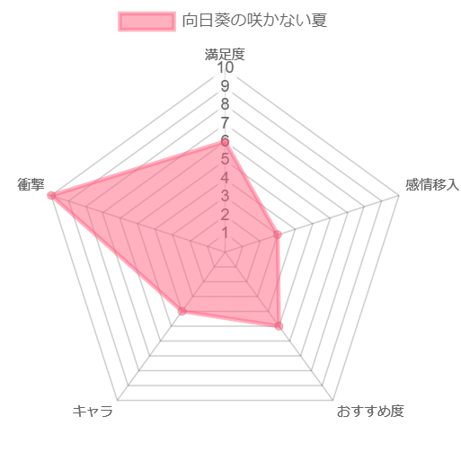

# 向日葵の咲かない夏

## 概要

-   夏休みを迎える卒業式の日、先生に頼まれ、欠席した級友の家を訪れる主人公
-   しかし、そこにいた級友は、首をつって死んでいた
-   その衝撃もつかの間、彼の死体は忽然と消えてしまう
-   一週間後、級友はあるものに姿を変えて現れる
-   主人公と、3 歳の妹、あるものに変わった級友の 3 人で事件を追い始める、ミステリー（？）作品

## 評価

<!-- prettier-ignore -->
!!! warning
    ここ以降は、本編のネタバレを含みます

## 第一章

-   主人公とその周辺環境の紹介
    -   主人公が小学 4 年生、妹が 3 歳らしいけど精神年齢が高すぎる
    -   母親は精神病・・・？主人公のついた「嘘」は後で回収されるんだろうけど息子に対する扱いじゃないよなぁ
    -   主人公から見た「狂っている世界」は何かの伏線？
-   S 君の自殺
    -   小学 4 年生で同級生の自殺目撃とかトラウマレベルが高い
    -   周りの動物が死んでるのとの関係ってなんだろうな。一連で同じ事件とはならないよな。対象も殺し方も違うし
    -   てか自殺した友人を目の前で見てしまった小学 4 年生に対するケア少なくない？そんなもんなん？

## 第二章

-   家族での食事シーン
    -   この母親しんどすぎるから出来るだけ描写しないでほしい・・・
    -   父親も無害感出してるけどかなりのゴミ。子供に対する扱いとして許しちゃダメだろ
    -   後は父親が話してた「7 日毎に転生する話」か。この理屈で S 君が何かに変わって出てくるのね
        -   これ自体は S 君が登場するための設定だと思うけど、それ以上の意味あるのかな？
        -   わざわざ壮大なファンタジー要素入れてきたわけだし、普通ならもっと活用したいよね
-   謎のおばあちゃんのヒント
    -   正直全然分からんかったｗ
    -   「臭い」は伏線なんだろうけど、まぁ知らんよね
        -   主人公はあんま S 君の排泄物が臭わなかったとか言ってたか？
        -   よく考えたら主人公が S 君の家に行ったときに排泄物がぽたぽた落ちてる描写があるってことは、死んだ時間がそのちょっと前だったりするのか？首吊り自殺の普通を知らん
    -   てかかなりファンタジー要素強めなんだなこの作品。おばあちゃんヤバイ人やん
-   背中が曲がっているおじいちゃん
    -   背中が痛いこととかめっちゃ曲がってることの描写多すぎ。なんか意味あんのか？
    -   何かしらの重要人物の目撃者だし、今後も出てきそう
    -   後時間がしれっと巻き戻ってるのね。節の始まりにしれっと時間書いてあるからそこ整理しながら見ないといけないか？

## 第三章

-   S 君の転生
    -   クモに転生きついなぁ
    -   普通に受け入れられるもんじゃないだろ、本当に S 君なのか謎だな
-   岩村先生
    -   犯人速攻ネタバレやばいな
    -   主人公の妄想の可能性とか考えたけど、おじいちゃんと時刻もあってるし、本当のことなんだろうな
    -   動機とか S 君に身に覚えないんだよなぁ。多分昔ちょっと売れた小説ってのが「性愛への審判」なんだろうけど、少年の遺体を凌辱する事が目的なら、動物殺してることと整合性取れないんだよなぁ
-   臭いの話
    -   S 君の説も主人公の説も両方しっくりこない
    -   どちらも犬が吠えていたことは「臭い」のせいだって言い分だけど、そもそも S 君の犬は S 君が殺されたところも、他の動物が殺されたところも見てないんだから、何もわかるはずないじゃん

## 第四章

-   学校
    -   スミダさんが好き設定いるのか？ｗ
    -   スミダさんにＳ君のことばれちゃったというか、都合がいいよな。クモの入った瓶を持ってるだけで、それをＳ君だと思うなんて
-   作文
    -   存在忘れてたけど、まぁ絶対重要だよね
    -   現時点では特に思いつかないからメモだけ
    -   ✖ 印のくぼみは上から押した後って書かれてたから、そこの文字には意味ないと思ってたけど、Ｓ君の反応的にあるのかな？
-   犬
    -   臭いとか関係なく吠え散らかしてるじゃんかｗ

## 第五章

-   岩村先生
    -   少年性癖やべえｗ五章ほぼこの記憶しかないわｗ
    -   しかし岩村先生の情報が後出しばっかなんんだよな
        -   実は元演劇
        -   性的なアンケートを生徒に対して行っていた
    -   まぁハッキリとはしないものの、Ｓ君殺した動機っぽいのは何となくわかるか
    -   でももし死体が岩村先生の家にあったら臭いで分かるとおもうけどなぁ
-   おじいちゃん
    -   Ｓ君が誰かと話していたかも？とかいう話より誰か見たんだろ？そっちの話しろやｗ

## 第六章

-   性愛への審判
    -   おじいちゃんあっさり教えちゃうのね。自分で警察には言わないけど、見ず知らずの小学生に教えちゃうの謎だな
    -   内容的に子供に教えるのどうかと思うんだけどなぁｗ
    -   ちょっと気になったのは、妹のことガン無視なんだよな。普通 3 歳の妹連れててそれに触れないか？描写の問題か
-   学校で岩村先生と対面
    -   名札には気づいてないんだな
    -   放っておくのめっちゃヤバそうだけど、忠告だけして殺さないんだな。いや殺されたら物語終わるし、ご都合主義なんだろうけど
-   S 君の死体
    -   岩村先生が主人公を殺さなかったのは、ばれないで死体を捨てれる算段があったから？
    -   でもこれ、首に挟殺の後見つかるんじゃないの？ミイラ化までしてると分からないんかな？
    -   明言されてないからよく分からなかったけど、目くりぬかれてるってことだよな。Ｓ君の作文と同じ感じで。岩村先生ならＳ君の作文の内容は知ってるから実行可能だろうけど、これまた動機がよく分からん
-   トコおばあさん
    -   これまたＳ君をすっと信用する謎のおばあさん。まぁそもそもこいつがファンタジーだからいいか
    -   殺されたのは謎だよなぁ。それこそ岩村先生に関係ない。まぁ今後後出しで情報出てくるのか

## 第七章

-   S 君について
    -   とりあえず S 母、警察に話すか悩んだ内容小学生に話すの頭おかしすぎる
    -   犬に死体を追わせてたのはモチベ分からんなぁ。まぁいじめられてて歪んだって言えばそれまでだが
-   主人公の行動
    -   なんか狂い始めてて不穏なんですけどｗｗ
    -   妹とＳ君が仲良くしはじめて、嫉妬的なのと、Ｓ君に対する不信感？
    -   妹の指舐め始めるのはマジで理解不能ｗ
-   おじいちゃんの過去回想
    -   マジで意味わからんからメモだけ
    -   最後に「これがすべての始まり」とか言ってるし、このおじいちゃんなんかやってる？犬猫殺してた犯人説ある？
    -   Ｓ君の家の近くにいた猫の死骸とか、このおじいちゃんが殺してる説あるよね。位置的にも、わざわざそこに向かわないと殺しうるのはＳ君一家とこのおじいちゃんくらいだし

## 第八章

-   バツ印の話
    -   まぁある程度整合性取れてるし、S 君が犬猫を殺した説割と濃厚だよね
    -   むしろ S 君から出てきた「おじいちゃんがやってた説」はバツ印の話の説明になってない
    -   まぁでも犬猫の死体の匂いに S 君の犬が反応するのは真実だから、おじいちゃんから犬猫の死体の匂いがしていたといえばそうなのか？
    -   あと気になるのは最後に主人公が S 君の家に行った時の犬の描写だよな。その時は犬は怯えて出てこなかったってどういうことやねん
-   おじいちゃんの回想
    -   この人足の骨折ってそうなんですけどｗ
    -   だとするとバツ印の話はなんだったのか・・・
    -   犬猫殺してたのは S 君、足の骨折ってたのはおじいちゃんってパターンありえる？
    -   てか微妙に話逸れてってるけど S 君殺したのは？岩村先生からずれてってる

## 第九章

-   色々真相
    -   九章濃すぎるｗ設定が一気にひっくり返って頭おかしくなりそうだった
    -   ミカはトカゲだし、トコおばあさんは猫だし、スミダさんは百合の花なのね
        -   見返してみたけど、教室でスミダさんが入ってきたときに「クラスの女の子たちと」ってのは水の交換とかだったのか
        -   「白い肌」はホントに白かったんだなｗ
    -   全部主人公の妄想で、自作自演だったと。だから、岩村先生に殺されたとかいう設定は全部白紙ね
    -   そういやＳ君のこと打ち明けてるのは上の 3 人だなｗ狂ってるように見せてちゃんと分かってるの草
    -   石鹸の設定はそうなんだぁ、くらい。「向日葵の咲かない夏」ってタイトルと、一本咲いてない向日葵があるからそれはなんかあるのかなぁとは思ってたけど

## 第十章

-   S 君の自殺の真相
    -   お前のせいなんかーいｗ
    -   確かに演劇に話はちょっと出てたけど、これは分からんわｗ
    -   真面目に解こうとするのが間違ってるのか。ミステリー小説じゃないんだなこれ。ホラー小説の一種なんだ
-   母親の精神病
    -   まぁ、一定の納得。娘が死んで狂ったと。
    -   とはいえ、主人公のことあんな扱いにするのは共感できないけどなｗ
-   ラストシーン
    -   主人公が他の家に引き取られるとか、主人公のケガの描写だけあるのは、主人公だけ生き残って他の人は死んだってことだろうなぁ
    -   冒頭に妹は 4 歳になった時に死んだって書いてあるから、トカゲは生きてたんかな？

## 総括

-   胸糞悪いエンドだったなぁ。ストーリー全体が暗いし
-   「トコおばあさんは実は猫だった」から始まる怒涛のマジ！？って展開は確かに凄かった。叙述トリックここに極まれりって感覚
-   まぁでも、登場人物に心情だったり、謎解きにはフォーカスしてなかったから、梯子を外された感じが強い
-   「学校ぐらし！」の第一話の衝撃を小説一冊分使ってやられた感覚
-   この小説他の人に勧める気はあんま起きないなぁ。「好き嫌いが分かれる」って書かれてるけど、自分は嫌いよりかも。ここから学べるものはそんなにない
